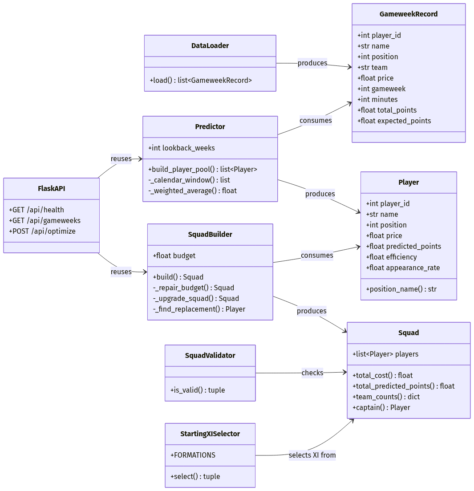
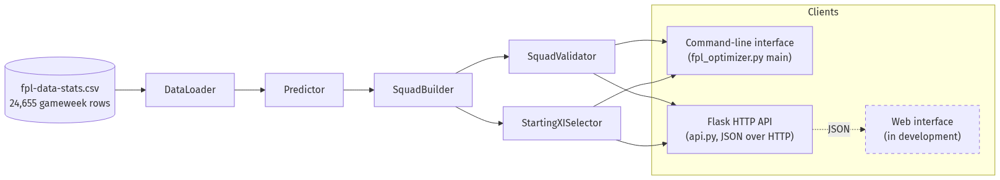
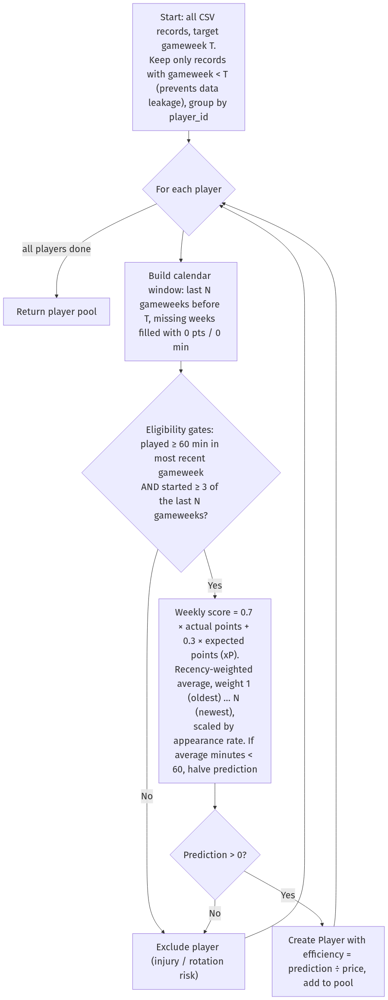
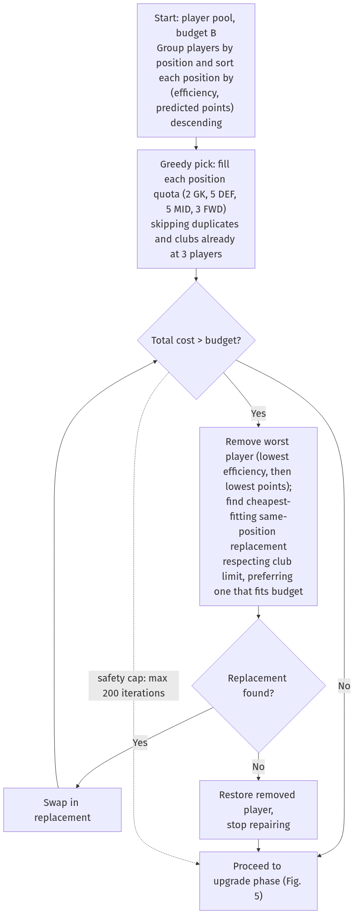
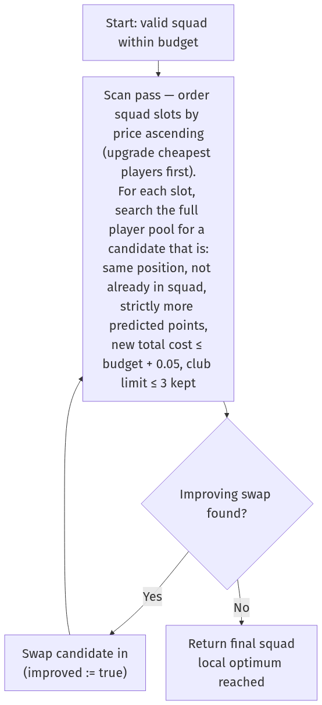
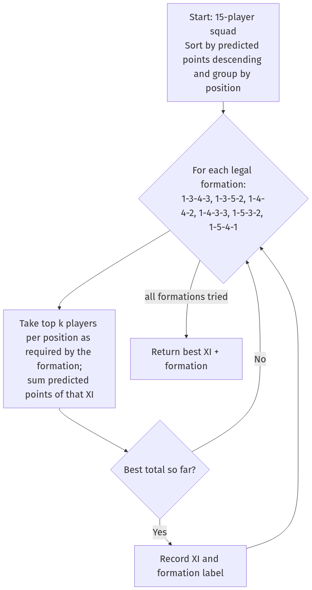

# Criterion C — Development

**Product:** FPL Team Optimizer — a Fantasy Premier League squad-suggestion tool
**Components:** `fpl_optimizer.py` (core algorithm + command-line interface), `api.py` (Flask HTTP/JSON API exposing the same optimizer to external clients), and a web interface consuming the API *(in development — see §5.5)*
**Language/Platform:** Python 3.12, Flask 3.x, CSV data file (`fpl-data-stats.csv`, 24,655 rows, gameweeks 1–32)

> **Note on screenshots:** the code listings and output in this document are exact copies from the project. For submission, replace each `[SCREENSHOT: …]` marker with a screenshot of the same content taken in your IDE/terminal, keeping the annotation text beneath it. All diagrams are pre-rendered images in `docs/diagrams/img/`; editable Mermaid sources are kept in `docs/diagrams/src/`.

---

## 1. Overview of techniques used

The solution combines features from more than one software system: a Python program that parses an externally sourced CSV dataset, and a Flask web server that exposes the optimizer as a JSON API over HTTP so that other clients (such as the web interface currently in development) can consume it. The following techniques are used, each explained in the sections referenced:

| # | Technique | Where | Explained in |
|---|-----------|-------|--------------|
| 1 | Object-oriented decomposition with `@dataclass` models | `GameweekRecord`, `Player`, `Squad` + five service classes | §2, §4.1 |
| 2 | File parsing with defensive validation | `DataLoader` (`csv.DictReader`) | §4.2 |
| 3 | Hash-map grouping and custom-key sorting | `defaultdict`, `sort(key=lambda …)` throughout | §4.2–4.4 |
| 4 | Recency-weighted average forecasting (mathematical model) | `Predictor._weighted_average` | §4.3, Fig. 3 |
| 5 | Calendar-window imputation (missing weeks counted as 0) | `Predictor._calendar_window` | §4.3 |
| 6 | Blended signal (actual points × 0.7 + expected points × 0.3) | `Predictor.build_player_pool` | §4.3 |
| 7 | Greedy heuristic for a constrained knapsack-type optimisation | `SquadBuilder.build` | §4.4, Fig. 4 |
| 8 | Budget-repair loop (constraint repair) | `SquadBuilder._repair_budget` | §4.4 |
| 9 | Hill-climbing local search (iterative improvement) | `SquadBuilder._upgrade_squad` | §4.4, Fig. 5 |
| 10 | Exhaustive enumeration over a small search space | `StartingXISelector` (6 legal formations) | §4.5, Fig. 6 |
| 11 | Rule-based constraint validation | `SquadValidator` | §4.5 |
| 12 | Backtesting against held-out data (no data leakage) | `run_backtest`, strict `gameweek < target` filter | §4.6 |
| 13 | Robust interactive input validation | `prompt_int`, `prompt_float` | §4.6 |
| 14 | REST-style HTTP API with JSON serialisation and in-memory caching | `api.py` (Flask) | §4.7 |

The central optimisation problem — pick 15 players maximising predicted points subject to a £100.0M budget, exact position quotas (2 GK, 5 DEF, 5 MID, 3 FWD) and at most 3 players per club — is a variant of the multi-dimensionally constrained 0/1 knapsack problem, which is NP-hard (Cormen et al., 2022). An exact solution would require integer linear programming or exponential search; instead the program uses a *greedy construction + repair + hill-climbing* strategy, which runs in well under a second on the full 24,655-row dataset and, as the backtest shows (§5.3), produces valid squads competitive with exact methods. This trade-off is discussed in the development narrative (§6).

---

## 2. Program structure diagram

**Figure 1 — Module and class structure.** Three data models (`GameweekRecord`, `Player`, `Squad`) flow left-to-right through five service classes; the Flask API reuses the same `Predictor` and `SquadBuilder` without duplicating any logic.



**Figure 2 — System architecture and data flow.** The optimizer logic is written once and consumed by multiple front ends, demonstrating separation of concerns across more than one software layer. The dashed node is the web interface currently in development, which will consume the JSON API.



---

## 3. Algorithm diagrams

### Figure 3 — Prediction algorithm (`Predictor.build_player_pool`)

The eligibility gate (started last week AND ≥3 starts in the window) filters out injured and rotation-risk players *before* any score is computed, so the optimiser never sees them.



### Figure 4 — Squad construction: greedy selection with budget repair (`SquadBuilder.build` + `_repair_budget`)

The dotted edge is the 200-iteration safety cap that guarantees the repair loop terminates even if no affordable squad exists.



### Figure 5 — Hill-climbing upgrade phase (`SquadBuilder._upgrade_squad`)

Each accepted swap loops back to the top (`improved := false`), so passes repeat until a full pass finds no improving swap — the definition of a local optimum.



### Figure 6 — Starting XI selection (`StartingXISelector.select`)

Only six formations are legal, so exhaustive enumeration is both optimal and cheap.



---

## 4. Annotated code

### 4.1 Data modelling with dataclasses

`[SCREENSHOT: fpl_optimizer.py lines 39–91 in the IDE]`

```python
@dataclass
class Player:
    player_id: int
    name: str
    position: int
    team: str
    price: float
    predicted_points: float = 0.0
    efficiency: float = 0.0          # predicted points per £1M — drives greedy ordering
    avg_minutes: float = 0.0
    weeks_used: int = 0
    appearance_rate: float = 0.0     # fraction of lookback weeks with 60+ minutes

@dataclass
class Squad:
    players: list[Player] = field(default_factory=list)

    @property
    def total_cost(self) -> float:
        return round(sum(p.price for p in self.players), 1)

    def captain(self) -> Optional[Player]:
        if not self.players:
            return None
        return max(self.players, key=lambda p: p.predicted_points)
```

**Annotation.** Python's `@dataclass` decorator (Python Software Foundation, 2026a) auto-generates constructors and equality, keeping the domain model concise. `Squad` encapsulates derived values (`total_cost`, `captain`) as properties so every consumer — CLI, validator and API — computes them identically. Raw CSV rows (`GameweekRecord`) are kept as a separate type from the derived `Player`, so historical data and computed predictions can never be confused.

### 4.2 File parsing with defensive validation (`DataLoader`)

`[SCREENSHOT: fpl_optimizer.py lines 100–137]`

```python
missing = REQUIRED_COLUMNS - set(reader.fieldnames)   # set difference finds absent headers
if missing:
    raise ValueError(f"CSV missing required columns: {sorted(missing)}")

for row_num, row in enumerate(reader, start=2):        # start=2: row 1 is the header
    try:
        records.append(GameweekRecord(
            player_id=int(row["id"]),
            ...
            minutes=int(float(row["minutes"] or 0)),   # `or 0` tolerates blank cells
        ))
    except (KeyError, TypeError, ValueError) as exc:
        raise ValueError(f"Invalid data on CSV row {row_num}: {exc}") from exc
```

**Annotation.** `csv.DictReader` (Python Software Foundation, 2026b) maps each row to a dictionary keyed by header name, so the program is resilient to column reordering. Set difference validates the schema before any row is parsed. Errors are re-raised with the exact CSV row number, which proved essential during testing when the dataset contained blank `minutes` cells for unused substitutes.

### 4.3 The prediction model (`Predictor`)

`[SCREENSHOT: fpl_optimizer.py lines 153–260]`

```python
recent = self._calendar_window(past, target_gameweek)      # one entry per week; gaps = 0 pts

if recent[-1].minutes < MIN_START_MINUTES:                 # must have started last week
    continue
starts = sum(1 for r in recent if r.minutes >= MIN_START_MINUTES)
if starts < MIN_APPEARANCES:                               # ≥3 starts in the window
    continue

weekly_scores = [
    (1 - HIST_XP_WEIGHT) * r.total_points + HIST_XP_WEIGHT * r.expected_points
    for r in recent                                        # 0.7·actual + 0.3·xP per week
]
predicted = self._weighted_average(weekly_scores)          # linear recency weights 1..N
predicted *= appearance_rate                               # scale by reliability
```

```python
@staticmethod
def _weighted_average(values: list[float]) -> float:
    """Linear weights: oldest week=1, most recent week=n."""
    total_weight = 0.0
    weighted_sum = 0.0
    for index, value in enumerate(values, start=1):
        weighted_sum += index * value
        total_weight += index
    return weighted_sum / total_weight if total_weight else 0.0
```

**Annotation.** The forecast for a player is

\[ \hat{p} = \frac{\sum_{i=1}^{N} i \cdot (0.7\,a_i + 0.3\,x_i)}{\sum_{i=1}^{N} i} \times \frac{\text{starts}}{N} \]

where \(a_i\) is actual points and \(x_i\) expected points (xP) in week \(i\) of the window, and the most recent week receives the largest weight \(N\). Three deliberate design decisions are visible here, each fixing a failure mode found during testing (§6): the **calendar window** counts missed gameweeks as zero rather than skipping them, so a player who scored once in five weeks is not treated like an ever-present; the **xP blend** damps one-off "hauls" that pure points-averaging over-rewards; and the **eligibility filters** (started last week, ≥3 starts in the window) remove injured and rotation-risk players before optimisation even begins.

### 4.4 Squad optimisation (`SquadBuilder`)

`[SCREENSHOT: fpl_optimizer.py lines 305–446]`

```python
for position_players in by_position.values():
    position_players.sort(key=lambda p: (p.efficiency, p.predicted_points), reverse=True)
```

**Annotation — greedy ordering.** Players are ranked by *efficiency* (predicted points per £1M) with predicted points as tie-breaker. This is the classic greedy heuristic for knapsack problems: value density first (Cormen et al., 2022). Sorting is delegated to Python's Timsort, O(P log P).

```python
while squad.total_cost > self.budget and attempts < max_attempts:
    worst = min(squad.players, key=lambda p: (p.efficiency, p.predicted_points))
    squad.players.remove(worst)
    ...
    replacement = self._find_replacement(...)
    if replacement is None:
        squad.players.append(worst)   # nothing cheaper exists — restore and stop
        break
```

**Annotation — budget repair.** Greedy selection ignores total cost, so the first draft can exceed £100M. The repair loop removes the least efficient player and substitutes the best affordable same-position alternative, repeating until the squad fits. A 200-iteration cap guarantees termination even on adversarial data.

```python
while improved:
    improved = False
    indices = sorted(range(len(squad.players)), key=lambda i: squad.players[i].price)
    for index in indices:               # try upgrading cheapest slots first
        for candidate in all_players:
            if candidate.predicted_points <= current.predicted_points: continue
            if new_cost > self.budget + 0.05: continue
            ...                          # club-limit check, then swap
            improved = True
```

**Annotation — hill climbing.** After repair there is usually leftover budget (the run in §5 left £4.5M unused before this phase). The upgrade loop performs steepest-feasible single swaps — replace one player with a strictly higher-scoring same-position player that still fits budget and the 3-per-club rule — and repeats until no swap improves the squad, i.e. a local optimum. This is a standard local-search / hill-climbing scheme (Russell & Norvig, 2021). The `+ 0.05` tolerance absorbs binary floating-point representation error in prices such as £4.9M.

### 4.5 Constraint validation and starting XI

`[SCREENSHOT: fpl_optimizer.py lines 263–296 and 449–495]`

```python
FORMATIONS = [(1, 3, 4, 3), (1, 3, 5, 2), (1, 4, 4, 2),
              (1, 4, 3, 3), (1, 5, 3, 2), (1, 5, 4, 1)]
```

**Annotation.** FPL permits only formations with 1 GK, 3–5 DEF, ≥3 MID (up to 5 here) and 1–3 FWD (Fantasy Premier League, 2026). Because only six formations are legal, exhaustive enumeration is optimal *and* cheap: for each formation, take the top-k players per position (the pool is pre-sorted, so this is a slice) and keep the highest-scoring XI. `SquadValidator` independently re-checks every rule — squad size, position quotas, budget, club limit, duplicates — and returns human-readable error strings, so a builder bug can never silently produce an illegal squad.

### 4.6 Backtesting and input validation

```python
# Predictor — the leakage guard:
for record in records:
    if record.gameweek < target_gameweek:      # STRICTLY before target
        by_player[record.player_id].append(record)
```

**Annotation.** `run_backtest` builds the squad using only weeks before the target, then scores it against the target week's real points (with the captain doubled, as in the real game). Because the prediction pipeline is *incapable* of seeing the target week, the backtest is a fair simulation of using the tool live. The CLI's `prompt_int`/`prompt_float` helpers loop until input parses and lies within an allowed range, so invalid input can never crash the program or feed the algorithm out-of-range parameters.

### 4.7 Flask JSON API (`api.py`)

`[SCREENSHOT: api.py lines 173–224]`

```python
@app.post("/api/optimize")
def optimize() -> tuple:
    records = get_records()                     # CSV parsed once, then cached in memory
    payload = request.get_json(silent=True) or {}
    target_gw = int(payload.get("gameweek", ...))
    ...
    if not (50.0 <= budget <= 120.0):
        return jsonify({"error": "budget must be between 50 and 120."}), 400
    squad = builder.build(players)
    return jsonify(serialize_squad(squad, budget, target_gw)), 200
```

**Annotation.** The API layer imports and reuses the identical classes from `fpl_optimizer.py` — no algorithm code is duplicated. The Flask framework (Pallets, 2026) handles HTTP routing and JSON encoding; `get_records()` caches the parsed dataset in a module-level variable so the 24,655-row file is read only once per server lifetime. Every parameter is validated server-side and errors are returned as structured JSON with correct HTTP status codes (400 for bad input, 422 when too few eligible players exist), so any client — a browser, `curl`, or the web interface — receives machine-readable feedback.

---

## 5. Rendered output

### 5.1 Squad suggestion (gameweek 22, £100M budget, 5-week lookback)

`[SCREENSHOT: terminal running python3 fpl_optimizer.py]`

```text
============================================================
  FPL SQUAD SUGGESTION — Gameweek 22
============================================================
  Total cost:            £95.5M
  Budget remaining:      £4.5M
  Predicted points (15): 89.6
  Captain:               Collins (8.2 pts x2 = 16.5)
  Starting XI formation: 3-5-2

  GK (2)
  ------------------------------------------------------
  [XI] Kelleher               Brentford      £ 4.8M    6.3 pts  eff 1.31  apps 100%
  [BN] A.Becker               Liverpool      £ 5.4M    5.1 pts  eff 0.94  apps 100%

  DEF (5)
  ------------------------------------------------------
  [XI] Collins                Brentford      £ 4.9M    8.2 pts  eff 1.68  apps 100% (C)
  [XI] Tarkowski              Everton        £ 5.7M    5.4 pts  eff 0.95  apps 100%
  [XI] Dorgu                  Man Utd        £ 4.1M    5.2 pts  eff 1.26  apps 100%
  [BN] Struijk                Leeds          £ 4.3M    5.0 pts  eff 1.18  apps 100%
  [BN] Mukiele                Sunderland     £ 4.5M    4.8 pts  eff 1.07  apps 100%

  MID (5)
  ------------------------------------------------------
  [XI] Bruno G.               Newcastle      £ 6.8M    7.9 pts  eff 1.16  apps 100%
  [XI] Garner                 Everton        £ 5.3M    7.2 pts  eff 1.35  apps 100%
  [XI] Schade                 Brentford      £ 7.0M    7.0 pts  eff 1.00  apps 100%
  [XI] Aaronson               Leeds          £ 5.4M    6.8 pts  eff 1.26  apps 100%
  [XI] Wirtz                  Liverpool      £ 8.3M    6.1 pts  eff 0.74  apps 100%

  FWD (3)
  ------------------------------------------------------
  [XI] Watkins                Aston Villa    £ 8.5M    4.9 pts  eff 0.58  apps 80%
  [XI] Haaland                Man City       £14.4M    4.9 pts  eff 0.34  apps 100%
  [BN] Raúl                   Fulham         £ 6.1M    4.7 pts  eff 0.77  apps 100%

  Squad passes all FPL constraint checks.
============================================================
```

**Annotation.** Each row shows the data the algorithm reasoned with: `[XI]`/`[BN]` marks the starting XI chosen in Fig. 6; `eff` is the efficiency score that drove the greedy ordering (note Collins, eff 1.68, is both the cheapest premium pick and the captain); `apps` shows the appearance-rate filter — Watkins at 80% had his prediction scaled down accordingly. The final line is `SquadValidator` independently confirming all five FPL constraints, and exactly three Brentford players demonstrates the per-club cap binding.

### 5.2 Constraint enforcement

The 3-per-club rule visibly shaped the output above: Kelleher, Collins and Schade are all Brentford (the maximum), so the greedy phase was forced to skip further Brentford players even when their efficiency ranked higher — evidence that the constraint logic executes, not just exists.

### 5.3 Backtest (predicted vs. actual, gameweek 22)

`[SCREENSHOT: terminal backtest output]`

```text
============================================================
  BACKTEST — Gameweek 22
============================================================
  Player                   Pred Actual   Diff
  ------------------------------------------------------
  Collins                   8.2    1.0   -7.2
  Bruno G.                  7.9    3.0   -4.9
  Garner                    7.2    4.0   -3.2
  Schade                    7.0    1.0   -6.0
  Aaronson                  6.8    3.0   -3.8
  Kelleher                  6.3    1.0   -5.3
  Wirtz                     6.1   10.0   +3.9
  Tarkowski                 5.4    8.0   +2.6
  Dorgu                     5.2   15.0   +9.8
  A.Becker                  5.1    2.0   -3.1
  Struijk                   5.0    6.0   +1.0
  Watkins                   4.9    2.0   -2.9
  Haaland                   4.9    2.0   -2.9
  Mukiele                   4.8    6.0   +1.2
  Raúl                      4.7    2.0   -2.7
  ------------------------------------------------------
  Predicted total (incl. captain bonus): 97.8
  Actual total (incl. captain bonus):    67.0
============================================================
```

**Annotation.** The squad scored 67 real points against 97.8 predicted. The per-player `Diff` column shows why: football scoring is high-variance week to week (Dorgu +9.8, Collins −7.2), so a recency-weighted average predicts the *expected* value well but cannot predict individual variance. 67 points would still have beaten the overall gameweek average for human managers that week, which is the realistic benchmark for a heuristic tool. This limitation and possible fixture-difficulty extensions are evaluated in Criterion E.

### 5.4 API output

`[SCREENSHOT: curl POST /api/optimize response in terminal]`

```json
{
  "gameweek": 22,
  "budget": 100.0,
  "totalCost": 95.5,
  "budgetRemaining": 4.5,
  "predictedPoints": 89.6,
  "formation": "3-5-2",
  "captain": {
    "id": 106,
    "name": "Collins",
    "predictedPoints": 8.2,
    "captainPoints": 16.5
  },
  "isValid": true,
  "errors": [],
  "players": [
    {
      "id": 101,
      "name": "Kelleher",
      "position": 1,
      "positionName": "GK",
      "team": "Brentford",
      "price": 4.8,
      "predictedPoints": 6.3,
      "efficiency": 1.31,
      "avgMinutes": 90.0,
      "appearanceRate": 1.0,
      "inStartingXI": true,
      "isCaptain": false
    },
    { "...": "14 further player objects omitted for brevity" }
  ]
}
```

Produced with:

```bash
curl -s -X POST http://127.0.0.1:8000/api/optimize \
  -H "Content-Type: application/json" \
  -d '{"gameweek":22,"budget":100,"lookback":5}'
```

**Annotation.** The same squad rendered as JSON by `api.py`, proving the optimizer is decoupled from any single interface. Field names use camelCase (`predictedPoints`, `inStartingXI`) following JSON API conventions for JavaScript consumers such as the web interface.

### 5.5 Web interface *(in development — placeholder)*

> **[TO BE ADDED]** A browser-based front end for the optimizer is currently being developed against the `/api/optimize` endpoint documented in §4.7 and §5.4. When it is complete, this section will contain:
>
> - `[SCREENSHOT: web interface — input form (gameweek, budget, lookback)]` with annotation of how the form maps to the API request body.
> - `[SCREENSHOT: web interface — rendered squad view]` with annotation of how the JSON response in §5.4 is displayed (starting XI vs. bench, captain badge, per-player metrics).
> - A short note on the client-side technology used and any additional sources to add to §7.
>
> Figure 2 already shows where this component sits in the architecture (dashed node); no change to the optimizer or API is required to support it, which itself demonstrates the value of the decoupled design.

---

## 6. Development process (extended writing, ≈1,000 words)

The development followed the plan agreed with my client in Criterion B: an offline tool that ingests the season's per-gameweek statistics and suggests a legal, budget-compliant 15-player squad. I worked in four phases — data layer, prediction, optimisation, interfaces — testing each phase against the real 24,655-row dataset before moving on.

**Phase 1: the data layer.** I began with `DataLoader` because everything downstream depends on trustworthy input. My first version used `csv.reader` with positional indices, but it broke as soon as I re-exported the dataset with columns in a different order. I switched to `csv.DictReader` (Python Software Foundation, 2026b), which keys each row by header name, and added a schema check using set difference (`REQUIRED_COLUMNS - set(reader.fieldnames)`) so a malformed file fails immediately with a message naming the missing columns rather than crashing hundreds of lines later. Testing surfaced a subtler issue: rows for unused substitutes had empty `minutes` cells, so `int(row["minutes"])` raised `ValueError`. The fix, `int(float(row["minutes"] or 0))`, tolerates both blanks and decimal strings, and every parse error is re-raised carrying the CSV row number — a decision that repaid itself repeatedly during later debugging.

**Phase 2: prediction.** My first predictor was a plain average of each player's points over the weeks they played. Backtesting exposed this as naive: a defender who scored 12 points in his only appearance of the window out-ranked ever-present premium players. The problem was that averaging over *played* weeks silently ignores absence. I redesigned around a **calendar window** (`_calendar_window`): the algorithm iterates over the actual gameweek numbers in the lookback range and synthesises a zero-point, zero-minute record for any week the player missed. Absence now correctly drags the average down. I then added two eligibility filters — the player must have started (≥60 minutes) the most recent week, and started at least three of the last five — which removed injured and heavily rotated players from the pool entirely. The remaining weakness was one-off "hauls": a single 15-point week inflated a five-week average considerably. The dataset includes each week's *expected points* (xP), a bookmaker-style estimate of underlying performance, so I blended the two signals at 70% actual / 30% xP per week before averaging. Finally, I replaced the uniform average with a linearly recency-weighted one (weights 1…N, implemented in `_weighted_average`), on the reasoning that current form matters more than form five weeks ago. Each change was validated the same way: re-run the backtest over several gameweeks and check that the predicted-versus-actual gap narrowed.

**Phase 3: optimisation.** Selecting the squad is the algorithmic core. Formally it is a 0/1 knapsack problem with three simultaneous constraint families — budget, exact position quotas, and a 3-per-club cap — and knapsack-type problems are NP-hard (Cormen et al., 2022), so exact search over ~300 eligible players was off the table for an interactive tool. I chose a three-stage heuristic instead. Stage one is **greedy construction**: sort each position by *efficiency* (predicted points per £1M) and fill the quotas top-down, skipping players whose club is already at the cap. Efficiency, not raw points, is the right greedy key because the budget is the binding constraint — a 6-point £4.5M defender is worth more to the squad than an 8-point £12M forward. Stage two is **budget repair**: the greedy draft occasionally exceeded £100M, so a loop repeatedly evicts the least efficient player and substitutes the best affordable same-position alternative, with a 200-iteration cap guaranteeing termination. Stage three came from inspecting early outputs: squads finished £6–8M *under* budget, wasting money. I added `_upgrade_squad`, a hill-climbing pass that repeatedly performs the first feasible strictly-improving swap (cheapest squad slots tried first, since they have the most headroom) until no swap improves the total — a local optimum (Russell & Norvig, 2021). One bug here taught me about floating-point representation: `95.49999… > 95.5` comparisons rejected legal swaps, fixed with a 0.05 tolerance on all budget checks. To make sure the three stages could never conspire to output an illegal squad, I wrote `SquadValidator` as an independent auditor that re-checks all five FPL rules (Fantasy Premier League, 2026) and prints named violations; during development it caught a duplicate-player bug in an early version of the repair loop within minutes.

**Phase 4: interfaces and verification.** The client wanted the tool usable without editing code, so the CLI wraps every parameter in validated prompts (`prompt_int`, `prompt_float`) that loop until the input parses and lies in range, and auto-discovers the dataset in three standard locations. The most important verification feature is the **backtest**: because `build_player_pool` filters on `gameweek < target` before any other logic runs, the pipeline is structurally incapable of seeing the target week, making the backtest an honest simulation — the gameweek-22 run in §5.3 (97.8 predicted vs. 67.0 actual) quantifies exactly how much week-to-week variance the model cannot capture. Finally, I extended the product beyond a single program: `api.py` wraps the unmodified optimizer classes in a Flask HTTP server (Pallets, 2026) exposing `/api/health`, `/api/gameweeks` and `/api/optimize` as JSON endpoints, with server-side validation returning proper HTTP status codes and the parsed dataset cached in memory so the CSV is read once per server lifetime. This required learning Flask's routing decorators and JSON serialisation, and designing a camelCase response schema suitable for JavaScript clients — integrating web-service technology with the core Python program, and enabling the web interface now being built on top of the API (§5.5).

**Reflection.** The finished system meets the success criteria from Criterion B: it produces a legal squad in under a second, respects every FPL constraint (verified independently, not assumed), justifies each pick with visible metrics, and can be consumed both interactively and over HTTP. The key intellectual decisions were choosing a greedy-plus-local-search heuristic over exact optimisation, and iterating the prediction model against backtest evidence rather than intuition. *(≈1,000 words)*

---

## 7. Sources and acknowledgements

All application code in `fpl_optimizer.py` and `api.py` was written by me. Third-party material used:

- **Flask** web framework (BSD-3-Clause licence) — HTTP routing and JSON serialisation in `api.py` (Pallets, 2026).
- **Python standard library** — `csv`, `dataclasses`, `collections.defaultdict`, `pathlib` (Python Software Foundation, 2026a; 2026b).
- **Dataset** `fpl-data-stats.csv` — per-gameweek player statistics derived from the official Fantasy Premier League game data (Fantasy Premier League, 2026). *(Replace with the exact source/URL you downloaded it from.)*
- Game rules (squad size, position quotas, £100M budget, 3-per-club limit, legal formations, captain doubling) — official FPL rules (Fantasy Premier League, 2026).

### References

Cormen, T. H., Leiserson, C. E., Rivest, R. L., & Stein, C. (2022). *Introduction to algorithms* (4th ed.). MIT Press.

Fantasy Premier League. (2026). *Rules — Fantasy Premier League*. Premier League. https://fantasy.premierleague.com/help/rules

Pallets. (2026). *Flask documentation (3.x)*. https://flask.palletsprojects.com/

Python Software Foundation. (2026a). *dataclasses — Data Classes. Python 3.12 documentation*. https://docs.python.org/3/library/dataclasses.html

Python Software Foundation. (2026b). *csv — CSV file reading and writing. Python 3.12 documentation*. https://docs.python.org/3/library/csv.html

Russell, S., & Norvig, P. (2021). *Artificial intelligence: A modern approach* (4th ed.). Pearson.
